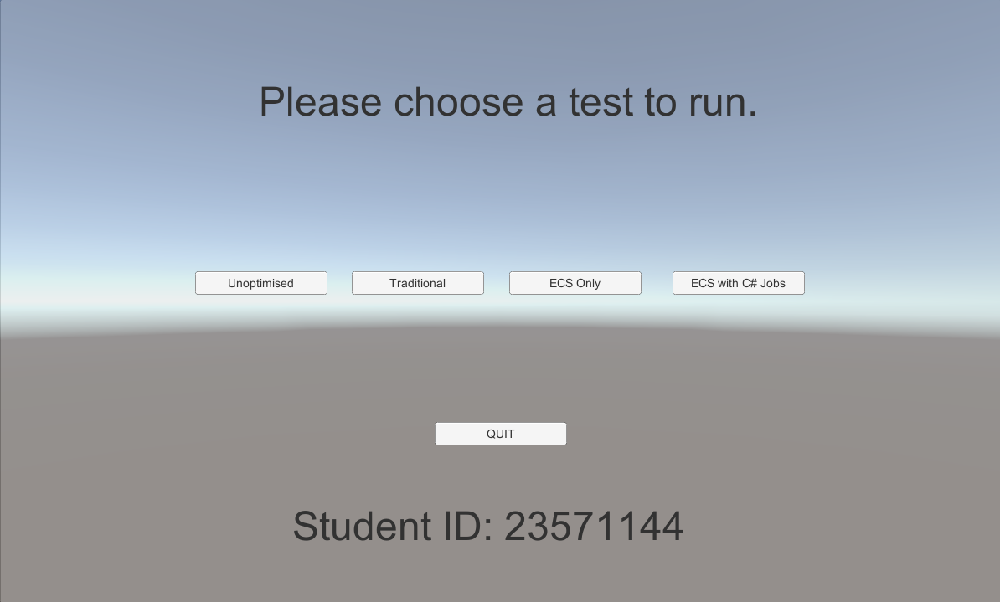
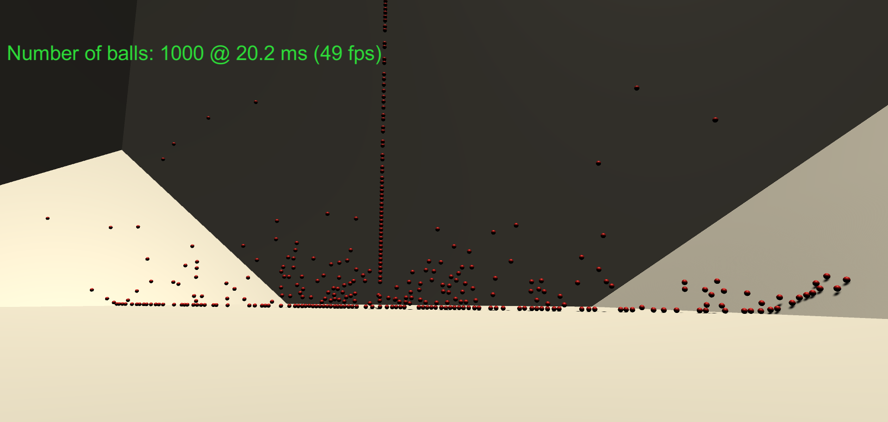
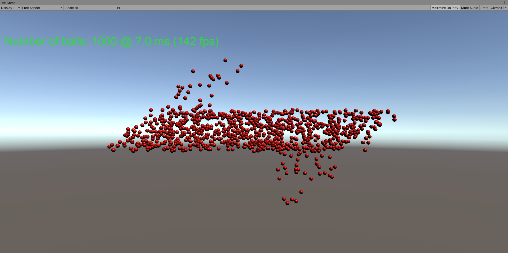

# EHU Final Year Project / R&D Dissertation 
Is Unity D.O.T.S worth using from a developer perspective?

# What is this Project about?
This Project Artefact of utilising Unity D.O.T.S (ECS, C# Job System and Burst Compiler) has looked into seeing the optimisation capabilities of Unity's new D.O.T.S framework / tech stack to see whether or not from a developer's point of view is worth utilising and learning to increase performance of their game as a Development Method?

# What does this Project Contain?
This Project contains various prototypes both using Traditional Methods of Optimisation (For Speed) and prototypes utilising the Data-Oriented-Design Approach with Use of ECS, C# Job-System and Burst Compiler. 

These Prototypes have been profiled, tested and compared with each other.

# Where is the report?
Check it out over on my google drive https://drive.google.com/file/d/12zyQWynkGm39f1v0wpAmGwmQffFuDtQx/view?usp=sharing

## Unity Version Used For This Project
- Unity 2019.3.0f6

## Sample Screenshots

## Dependancies Used
These Utilities / Libraries can be found within the Unity Package Manager.
- Burst Compiler - 1.2.1 (latest) 
- Entities - preview version 0.5.1
- Collections - preview version 0.5.1
- Jobs - preview 0.2.4
- Custom NUnit - preview version 0.5.1
- Mathematics - 1.1.0
- Mono Cecil - preview version 0.1.6
- Performance Testing API - preview version 1.3.3
- Unity Physics - preview 0.2.5

# Current Build Progress (4 / 4): Completed
- [x] Unoptimised Prototype
- [x] Traditional Prototype
- [x] ECS Only Prototype
- [x] ECS WITH JOBS Prototype

# Current Research Progress
- [x] Survey Sent And Recieved Feedback (101 Responses)
- [x] Survey Analysed 
- [x] Email Interviews Sent
- [x] Email Interviews Analysed
- [x] Focus Group Completed
- [x] Focus Group Transcribed
- [x] Focus Group Analysed
- [x] Profiling and Recording of Performances

------------------------------------------------------------------------
